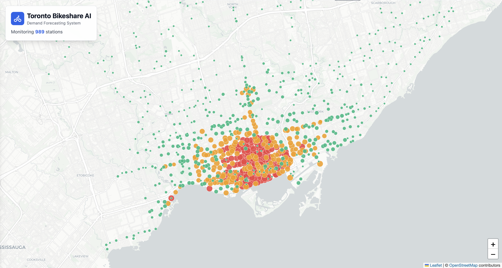

# Toronto Bikeshare ML Forecaster 

[**View Live Demo on Hugging Face Spaces**](https://huggingface.co/spaces/marwan1265/toronto-bikeshare-ML)



This project implements a full-stack machine learning application designed to forecast daily ridership demand for the Toronto Bikeshare network. By leveraging a Gated Recurrent Unit (GRU) neural network, the system analyzes historical trip data to predict station activity for the upcoming 24 hours, providing valuable insights into urban mobility patterns.

## System Architecture

The core of the application is a deep learning model trained on over **19 million historical trips**. The system operates through a unified architecture:

1.  **Data Ingestion**: Aggregates historical ridership data and real-time station status.
2.  **Inference Engine**: A PyTorch-based GRU model processes time-series data to generate demand forecasts for individual stations.
3.  **API Layer**: A FastAPI backend serves these predictions and manages data flow between the model and the user interface.
4.  **Visualization**: A React-based frontend renders an interactive map, utilizing color-coded indicators to visualize predicted demand and station capacity.

## Key Metrics

The model was rigorously trained and evaluated on a comprehensive dataset to ensure reliable performance.

*   **Dataset Size**: ~19.2 Million trips analyzed
*   **Network Coverage**: 878 active stations monitored
*   **Model Accuracy**: Mean Absolute Error (MAE) of **6.91**, meaning predictions are typically within 7 rides of the actual daily count.

## Tech Stack

*   **Frontend**: React, Vite, Tailwind CSS, Leaflet, Recharts
*   **Backend**: Python, FastAPI, Uvicorn
*   **Machine Learning**: PyTorch, Pandas, NumPy
*   **Deployment**: Docker, Hugging Face Spaces

## Running Locally

The easiest way to run the application locally is using Docker. This ensures all dependencies (both Python and Node.js) are correctly installed.

### Prerequisites
*   Docker installed on your machine.
*   Git

### Steps

1.  **Clone the repository**
    ```bash
    git clone https://github.com/marwan1265/toronto-bikeshare-ml.git
    cd toronto-bikeshare-ml
    ```

2.  **Build the Docker image**
    ```bash
    docker build -t bikeshare-ai .
    ```

3.  **Run the container**
    ```bash
    docker run -p 7860:7860 bikeshare-ai
    ```

4.  **Access the App**
    Open your browser and navigate to `http://localhost:7860`.


## AI Usage

I used AI tools to assist with code completion, data analysis, and deployment debugging for this project. Specifically:

1.  **Code Completion**: I utilized AI-powered tab completion features to accelerate the coding process.

2.  **Data Analysis & Interpretation**: I used an AI assistant to help interpret my model's performance metrics and gain a deeper understanding of the results. I provided the [metrics.json](cci:7://file:///Users/marwan/toronto-bikeshare-ml/artifacts/metrics.json:0:0-0:0) file containing the loss, RMSE, and MAE values and used the following prompt to generate an explanation and suggestions for improvement:
    > "You are an expert data scientist, especially proficient in evaluating model performace from training metrics. Given my metrics.json file which includes the loss, rmse, and mae after training my GRU prediction model. explain to me in leyman terms how accurate my model is and suggest ways I could improve it further, also how do I make sure that I did not overfit."
    
This analysis helped me understand the accuracy of my model in layman's terms and provided actionable insights for future improvements and overfitting prevention.

3.  **Deployment Debugging**: I encountered a bug when attempting to upload my trained model ([station_demand_gru.pt](cci:7://file:///Users/marwan/toronto-bikeshare-ml/artifacts/station_demand_gru.pt:0:0-0:0)) to Hugging Face Spaces due to its large file size. Since this was my first time hosting on Hugging Face Spaces, I used AI to debug the issue. The AI suggested creating a `.gitattributes` file and utilizing Git LFS (Large File Storage) to handle the large model artifact, which resolved the deployment error.
